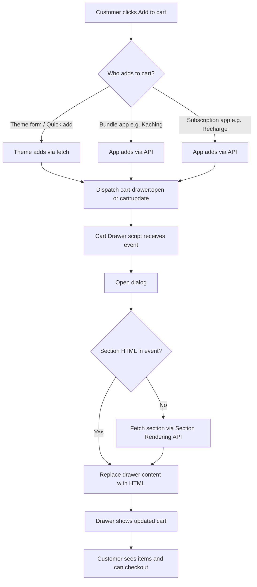

# 🛒 Shopify Cart Drawer (Standalone)

A **theme- and app-agnostic** cart drawer for Shopify. Works with **any theme**, **any add-to-cart** (theme or app), and **any app** (bundle widgets, subscription apps, etc.). Easy to install on client stores; no hard-coded theme dependencies.

**✅ Easy install on any client store** – Copy 5 files, add one line to the layout, add a cart icon. Works on any Online Store 2.0 theme.  
**✅ Compatible with any bundle and subscription app** – Kaching, Recharge, or any app that adds to cart: have the app (or one optional script) dispatch `cart-drawer:open` after add-to-cart and the drawer opens with the updated cart. No app-specific code inside the drawer.

[](https://www.shopify.com) [](https://shopify.dev/docs/api/liquid) [](https://developer.mozilla.org/en-US/docs/Web/JavaScript)

---

## 📸 Visual Preview

https://github.com/user-attachments/assets/0a40dabe-7405-4c3c-859d-148a48fe61f7

---

## ✨ Key Features

### 🛒 Cart drawer
- **Native `<dialog>`** – No theme dialog component required; works on any theme.
- **Section Rendering** – Refreshes cart content via Shopify’s Section Rendering API.
- **Minimal markup** – Simple line items and summary; easy to style to match your theme.

### 🔌 App- and theme-friendly
- **Event-driven** – Listens for `cart-drawer:open`, `cart:update`, `bundle:cart-added`.
- **Any add-to-cart** – Theme forms, quick add, **bundle apps (e.g. Kaching)**, **subscription apps (e.g. Recharge)**, or custom widgets: after adding to cart, dispatch one event and the drawer opens and refreshes.
- **No lock-in** – No dependency on a specific theme’s dialog or events; vanilla JS only.

### 🚀 Developer-friendly
- **Same repo structure** as [Bundle Offers Widget v2](https://github.com/rsusano/shopify-bundle-offers-widget-v2) – `sections/`, `assets/`, `snippets/`, `docs/`.
- **Documented events** – [App integration](docs/app-integration.md) explains how themes and apps can trigger the drawer.
- **Easy to extend** – Add shipping bar, upsell, or guarantee by editing the section and snippets.

---

## 📦 What's Included

```
shopify-CRO-custom-cart-drawer/
├── sections/
│   └── cart-drawer.liquid       # Cart drawer section (dialog + header, body, footer)
├── assets/
│   ├── cart-drawer-standalone.js  # Open/close, events, section refresh (vanilla JS)
│   ├── cart-drawer-app-bridge.js  # Optional: auto-open drawer after any fetch add-to-cart (theme or app)
│   └── section-cart-drawer.css    # Minimal layout styles
├── snippets/
│   ├── cart-drawer-items.liquid   # Line items list
│   └── cart-drawer-summary.liquid # Subtotal + checkout button
├── docs/
│   ├── installation.md           # Step-by-step install
│   └── app-integration.md        # Events for themes and apps
├── README.md
├── GETTING_STARTED.md
├── START_HERE.md
├── CHANGELOG.md
└── LICENSE
```

---

## 🚀 Quick Start

1. **Copy files** – Copy `sections/`, `assets/`, and `snippets/` into your theme root.
2. **Add to layout** – In `layout/theme.liquid` (or your main layout), add `` before `</body>`.
3. **Add cart opener** – In your header (or wherever you want the cart icon), add a button that dispatches `cart-drawer:open` (see [Installation](docs/installation.md)).
4. **Optional – auto-open with any app:** Include `cart-drawer-app-bridge.js` in your layout (after the cart drawer section). It listens for any successful add-to-cart (theme or app) and opens the drawer automatically. No per-app code needed. See [App integration](docs/app-integration.md).

Full steps: [GETTING_STARTED.md](GETTING_STARTED.md) · [docs/installation.md](docs/installation.md)

---

## 🧩 How It Works – Architecture Flow



**Summary:** Any source (theme or app) adds to cart, then dispatches a standard event. The drawer opens and refreshes its content from section HTML (from the event or by fetching). No theme-specific or app-specific code is required inside the drawer.

*Optional: add a short video here showing “add to cart → drawer opens → update quantity → checkout”.*

---

## 🛒 Compatibility

| Your setup | What to do |
|------------|------------|
| **Any theme** | Copy files, add section to layout, add cart icon that dispatches `cart-drawer:open`. |
| **Theme add-to-cart** | After your AJAX add-to-cart, dispatch `cart-drawer:open` (and optionally `cart:update` with section HTML). |
| **Bundle widget (e.g. Kaching)** | Add optional `cart-drawer-app-bridge.js` to your layout – drawer opens after any add-to-cart. Or have the app dispatch `cart-drawer:open`. |
| **Subscription widget (e.g. Recharge)** | Same: add `cart-drawer-app-bridge.js` for auto-open, or dispatch `cart-drawer:open` after the app adds to cart. |
| **Bundle Offers Widget v2** | Already dispatches `bundle:cart-added`; this drawer listens for it and opens and refreshes. No extra code. |
| **Any other app** | Use the optional app bridge script (see above) for one-click compatibility with any app that adds to cart via fetch. |

See [App integration](docs/app-integration.md) for event details and code examples.

---

## 📚 Events reference

| Event | Dispatched by | Payload | Use |
|-------|----------------|--------|-----|
| **`cart-drawer:open`** | Theme or app | Optional: `{ sections: { [sectionId]: html } }` | Open drawer and optionally refresh from `sections`. |
| **`cart:update`** | Theme or app | `{ sections: { [sectionId]: html } }` or none | Refresh drawer content (and open if needed). |
| **`bundle:cart-added`** | e.g. Bundle Offers v2 | `{ cart, itemCount, sections }` | Open drawer and refresh from `sections`. |
| **`cart-drawer:loaded`** | Cart drawer script | – | Fired when drawer content has been refreshed; use to update cart icon count. |

---

## 🧪 Testing checklist

- [ ] Cart icon opens the drawer.
- [ ] Drawer shows current cart items and total.
- [ ] Updating quantity and “Update” submits the form and refreshes (or navigate to cart and back).
- [ ] Checkout button goes to `/cart` or checkout.
- [ ] After add-to-cart (theme), dispatching `cart-drawer:open` opens the drawer with new items.
- [ ] With an app (bundle/subscription), after add-to-cart, dispatching `cart-drawer:open` opens the drawer.

---

## 🐛 Troubleshooting

| Issue | What to try |
|-------|-------------|
| Drawer doesn’t open | Ensure `cart-drawer-standalone.js` is loaded and your cart icon dispatches `cart-drawer:open`. Check console for errors. |
| Drawer opens but content doesn’t refresh | Section ID must match. Check `data-section-id` on the drawer wrapper; use the same ID when dispatching `cart:update` with sections. |
| App add-to-cart doesn’t open drawer | Add optional `cart-drawer-app-bridge.js` to your layout (load after cart drawer). It opens the drawer after any successful fetch to /cart/add. Or have the app dispatch `cart-drawer:open`. |

More: [docs/installation.md](docs/installation.md) · [docs/app-integration.md](docs/app-integration.md)

---

## 📄 License

MIT. Free for personal and commercial use. See [LICENSE](LICENSE). Attribution appreciated but not required.

---

## 💬 Support

- **Docs:** [GETTING_STARTED.md](GETTING_STARTED.md), [docs/](docs/)
- **Issues:** Open an issue on GitHub
- **Contact:** rsusano123s@gmail.com

---

**Standalone** – Works with any theme and any app.  
⭐ Star this repo if you find it helpful.
